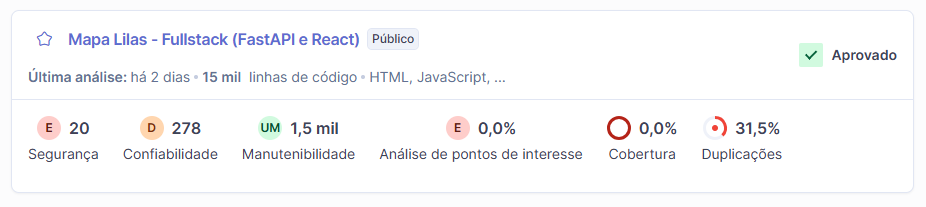

# Análise de Qualidade de Código (SonarQube)

Aqui você encontra a documentação gerada pelo SonarQube para a análise estática do nosso código.

### Mapeamento em Imagem

### Análise e Melhorias Identificadas

A ferramenta catalogou pontos de atenção lógicos e estruturais padrão para o ecossistema do projeto. A correção desses pontos é fundamental para evoluir o sistema e garantir estabilidade. Abaixo os principais destaques encontrados pelo relatório:

#### Duplicações de Código
O SonarQube identificou que **31,5%** do nosso código possui trechos idênticos copiados e colados em arquivos diferentes. Isso dificulta a manutenção do sistema porque qualquer alteração em uma regra de negócio precisaria ser replicada em múltiplos lugares. A solução é promover um maior reuso através da criação de componentes React globais e funções utilitárias centralizadas.

#### Confiabilidade
O projeto recebeu **nota D** em Confiabilidade devido à presença de **278 Bugs**. Esses problemas podem gerar comportamentos inesperados na aplicação ou travamentos para o usuário final. Resolver esses gargalos aumenta a tolerância a falhas do software.

#### Code Smells
Embora tenhamos tirado nota A em manutenibilidade, existem **1,5 mil "Code Smells"** menores. Eles não quebram o código atual, mas deixam o projeto poluído. A integração do nosso processo de *Linting* ataca diretamente este problema, simplificando futuras evoluções do sistema.
